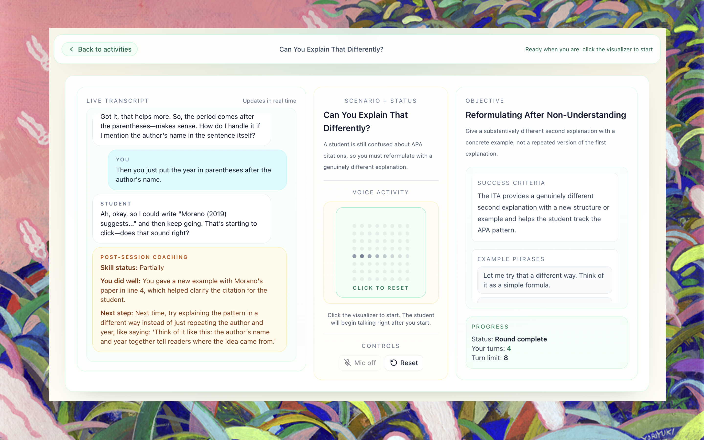

# ITA Interactional Competence Trainer

A voice-based practice tool for international teaching assistants (ITAs). ITAs speak with an AI-simulated student, then receive targeted coaching feedback after the session ends. The focus is on **interactional competence** — how to manage turns, check understanding, handle confusion, and keep classroom conversations productive — not pronunciation or grammar.

> **Status:** Active development in collaboration with educational researchers. The activity design, agent behavior, and evaluation rubrics are being refined through empirical testing. Contributions and forks are welcome.



---

## What it does

Each activity isolates **one interactional skill** and wraps it in a tightly scoped roleplay scenario. The AI student's behavior is scripted to create the exact moment where that skill is needed. After the session, a separate LLM reviews the full transcript and returns a brief coaching debrief: one strength, one next step, and a skill status (yes / partially / not yet).

**Six core activities ship with the repo:**

| Activity | Skill |
|---|---|
| The Quick "Yeah I Get It" | Genuine comprehension checking |
| That's Not On the Exam | Redirecting off-topic contributions |
| Can You Explain That Differently? | Reformulating after non-understanding |
| I Don't Know Either | Handling questions beyond your knowledge |
| What Do I Do First? | Giving clear sequential instructions |
| This Grade Is Unfair | Managing emotional responses with empathy |

The design rationale, research basis, and prompting conventions are documented in [`Planning/design-philosophy.md`](Planning/design-philosophy.md).

---

## Architecture

```
ita-trainer-app/
├── src/                     Next.js 16 frontend
│   ├── app/                 Pages and API routes
│   ├── lib/activities.ts    Single source of truth for all activities
│   ├── lib/utils.ts         Shared utilities
│   └── components/          UI components (shadcn/ui + Tailwind v4)
└── agent/                   LiveKit agent worker (Node.js)
    └── src/
        ├── main.ts          Worker entrypoint + room dispatch logic
        ├── agent.ts         createStudentAgent() — builds system prompt per activity
        └── activities.ts    Activity config consumed by the agent
```

**How a session works:**

1. User picks an activity on the Next.js frontend.
2. Frontend calls `/api/token` to get a LiveKit room token (carrying the `activityId`).
3. Browser joins the LiveKit room via WebRTC.
4. The agent worker picks up the job, reads the `activityId` from room metadata, assembles the student persona and behavioral rules, and joins the room as the AI student.
5. The AI student speaks the scripted opening line and the conversation begins.
6. When the session ends (user clicks End or max turns reached), the frontend calls `/api/debrief` with the transcript. A separate OpenAI call reviews it and returns coaching JSON.

The split between frontend and agent worker is intentional: it keeps real-time voice quality stable and separates concerns cleanly.

---

## Tech stack

- **Frontend:** Next.js 16, React 19, Tailwind v4, shadcn/ui
- **Voice runtime:** [LiveKit Cloud](https://livekit.io/cloud) (WebRTC room + audio routing)
- **AI student:** `@livekit/agents` + `@livekit/agents-plugin-openai` (OpenAI Realtime API)
- **Post-session debrief:** Vercel AI SDK (`ai` package) hitting a standard OpenAI chat model
- **Package manager:** pnpm (monorepo workspace)

---

## Local setup

### Prerequisites

- Node.js 20+
- pnpm
- [LiveKit Cloud](https://livekit.io/cloud) project (free tier works)
- OpenAI API key with access to Realtime API

### 1. Clone and install

```bash
git clone https://github.com/your-org/ita-trainer.git
cd ita-trainer/ita-trainer-app
pnpm install
```

### 2. Environment variables

Create `.env.local` in `ita-trainer-app/`:

```env
LIVEKIT_API_KEY=your_livekit_api_key
LIVEKIT_API_SECRET=your_livekit_api_secret
LIVEKIT_URL=wss://your-project.livekit.cloud
NEXT_PUBLIC_LIVEKIT_URL=wss://your-project.livekit.cloud
OPENAI_API_KEY=your_openai_api_key
OPENAI_REALTIME_MODEL=gpt-realtime-1.5
```

`OPENAI_REALTIME_MODEL` defaults to `gpt-realtime-1.5` if omitted. The debrief call uses `gpt-4.1-mini` by default (set `OPENAI_DEBRIEF_MODEL` to override).

### 3. Run the web app

```bash
# from ita-trainer-app/
pnpm dev
```

### 4. Run the agent worker

In a separate terminal:

```bash
# first run only — downloads voice model files
pnpm --filter ita-trainer-agent download-files

# start the agent worker
pnpm --filter ita-trainer-agent dev
```

Open `http://localhost:3000`, pick an activity, and start practicing.

---

## Deployment

### Web app — Vercel

Deploy `ita-trainer-app/` as a standard Next.js project. Add the same environment variables in Vercel project settings.

### Agent worker — LiveKit Cloud

The agent can be deployed to LiveKit Cloud using the LiveKit CLI:

```bash
lk cloud auth
lk project set-default "your-project-name"
lk agent create
```

Or build and run the Docker image manually:

```bash
cd ita-trainer-app/agent
docker build -t ita-trainer-agent .
docker run --env-file ../.env.local ita-trainer-agent
```

Make sure the agent and web app point to the same LiveKit project URL.

---

## Adding activities

All activity config lives in two files that mirror each other:

- **Frontend:** `ita-trainer-app/src/lib/activities.ts`
- **Agent:** `ita-trainer-app/agent/src/activities.ts`

Each activity implements this interface:

```typescript
interface Activity {
  id: string;                        // kebab-case, e.g. "quick-yeah-i-get-it"
  title: string;
  shortDescription: string;          // One sentence for the activity card
  fullDescription: string;           // Full briefing shown before practice
  level: "beginner" | "intermediate" | "advanced";
  estimatedMinutes: number;
  maxTurns: number;                  // Hard stop, typically 8–10

  studentProfile: {
    name: string;
    personality: string;             // Brief behavioral summary for prompt assembly
    openingLine: string;             // Exact scripted first line
  };

  objective: {
    title: string;                   // Skill name shown to the ITA
    description: string;             // What the ITA should do
    successCriteria: string;         // What "good" looks like — used by the debrief LLM
    examplePhrases: string[];        // 2–3 model phrases shown to the ITA before practice
  };

  systemPromptExtension: string;     // Behavioral rules injected into the agent system prompt
}
```

**Design checklist for new activities** (from [`Planning/design-philosophy.md`](Planning/design-philosophy.md)):

- One skill only. If you catch yourself writing "and also practice X," split it into two activities.
- Concrete content anchor. A specific topic both parties can discuss without special expertise.
- Scripted opening line that immediately creates the moment where the skill is needed.
- Behavioral rules covering 2–3 branches: ITA does the skill well / does a common ineffective version / doesn't attempt it.
- Natural resolution in 6–8 turns.
- Success criteria that a transcript-reviewing LLM can assess reliably.

After adding a new activity to both files, it will appear automatically on the home page and the agent will load its persona when a session starts.

---

## Project files

| Path | What it is |
|---|---|
| `Planning/design-philosophy.md` | Pedagogy rationale, activity design principles, agent prompt structure, and the full activity specs |
| `Planning/doc1-project-plan.md` | Product goals and user flow |
| `Planning/doc2-technical-guide.md` | Implementation architecture and LiveKit patterns |
| `Planning/prompting-guide-doc.md` | LiveKit voice agent prompting reference |
| `ita-trainer-app/src/lib/activities.ts` | Frontend activity definitions |
| `ita-trainer-app/agent/src/activities.ts` | Agent-side activity definitions |
| `ita-trainer-app/agent/src/agent.ts` | System prompt assembly per activity |

---

## Research context

This project is developed in collaboration with researchers studying ITA preparation and interactional competence assessment. The activity scripts, behavioral rules, and debrief rubrics are grounded in IC research (Young 2011; Wagner 2014) and are being iteratively tested and refined. If you are a researcher interested in contributing activity designs or evaluation data, open an issue or reach out directly.

---

## License

MIT
